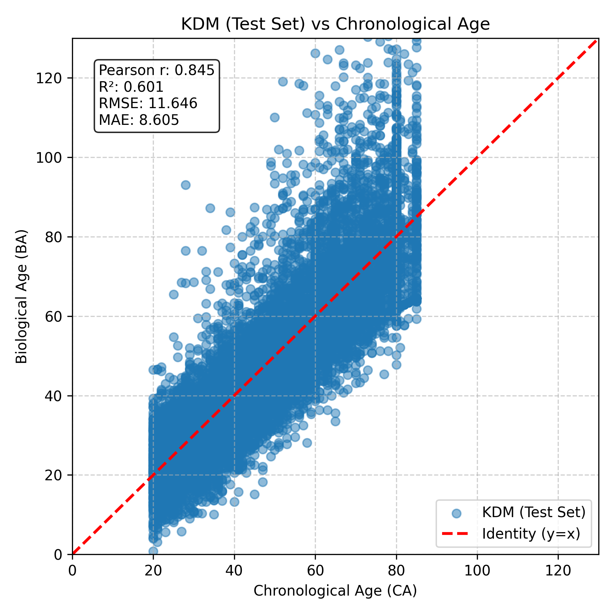
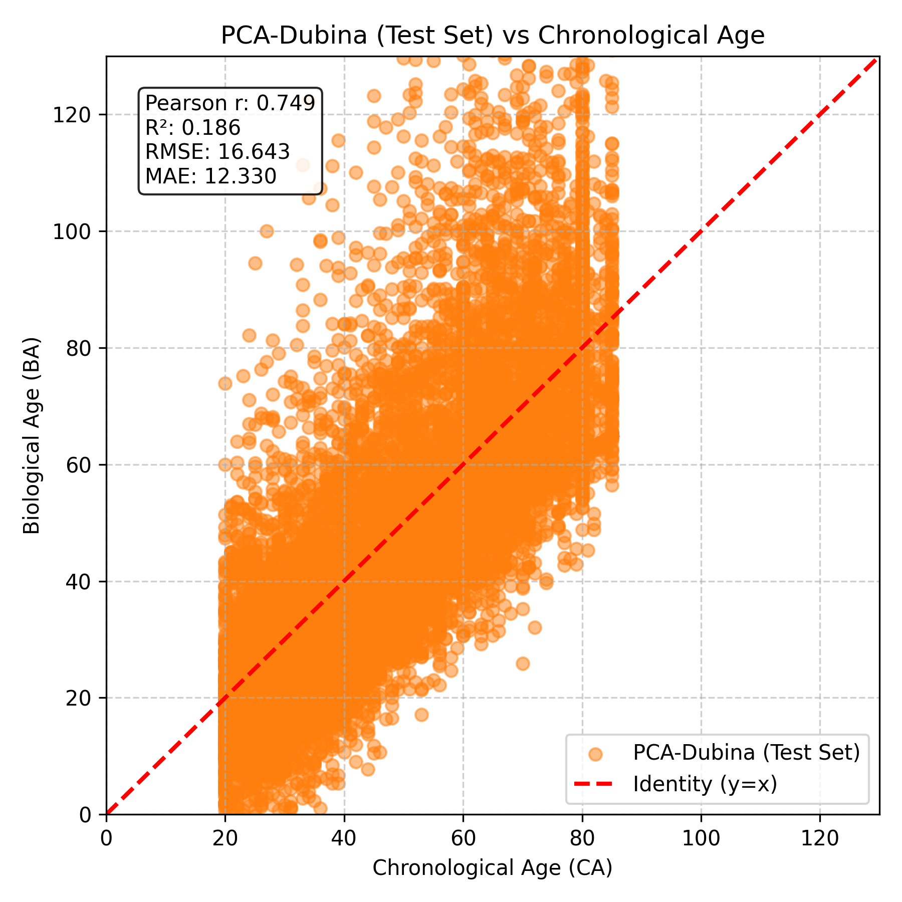
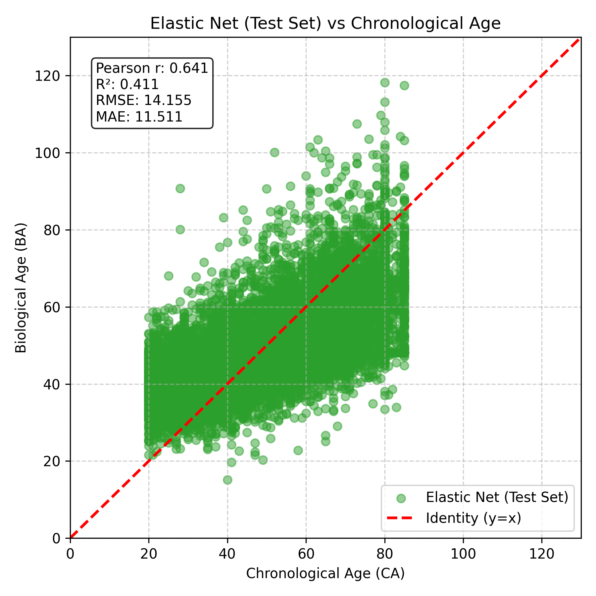
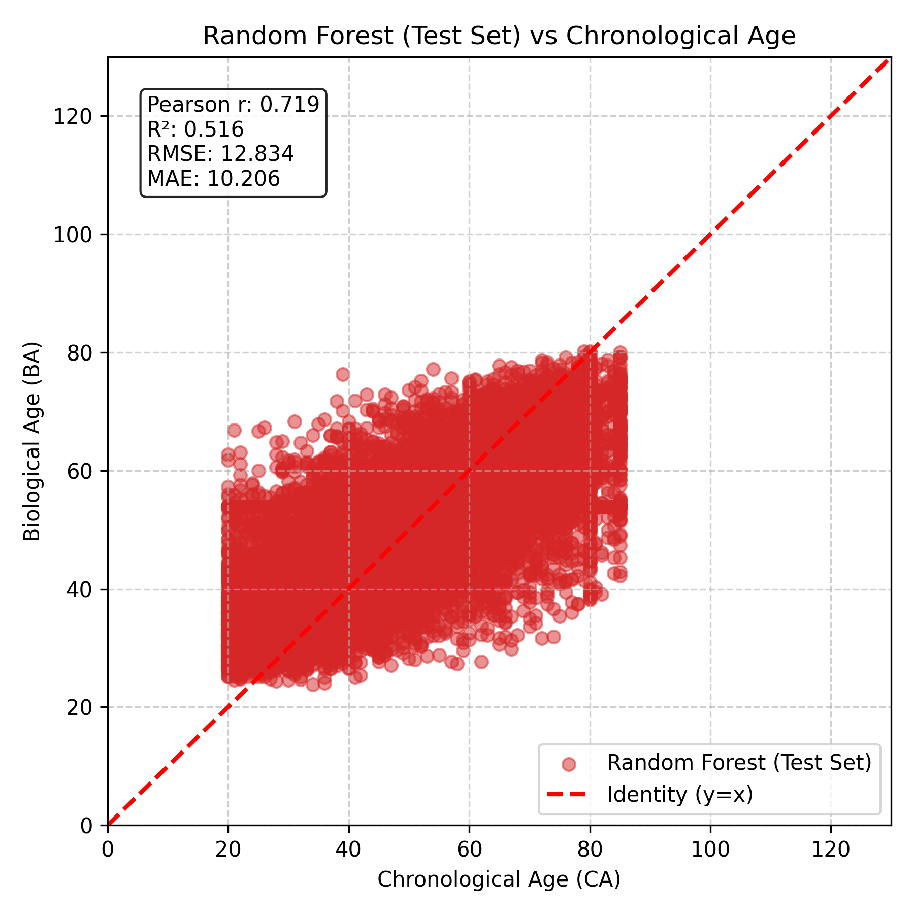
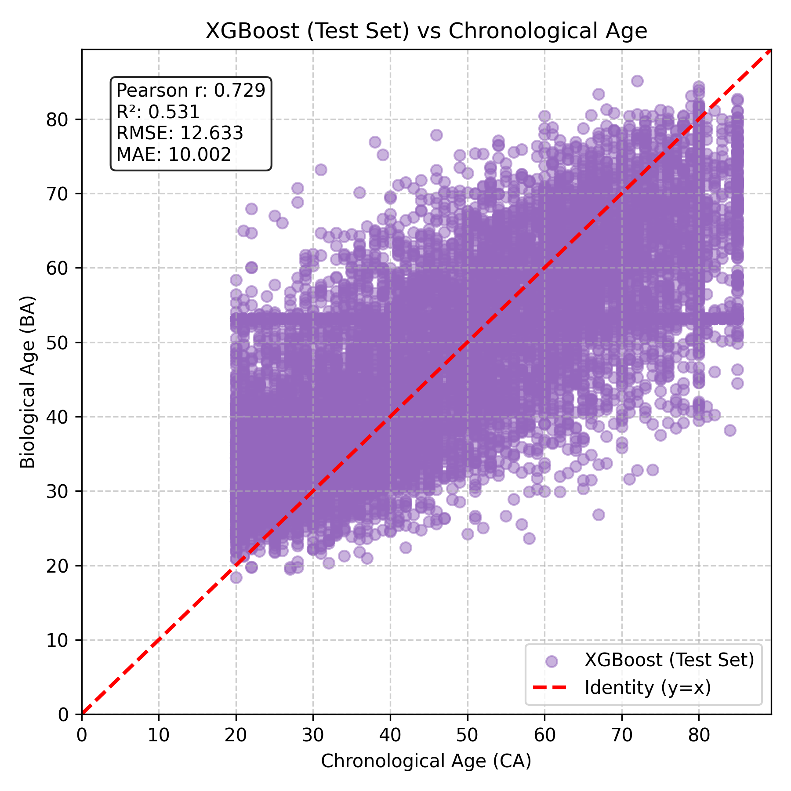
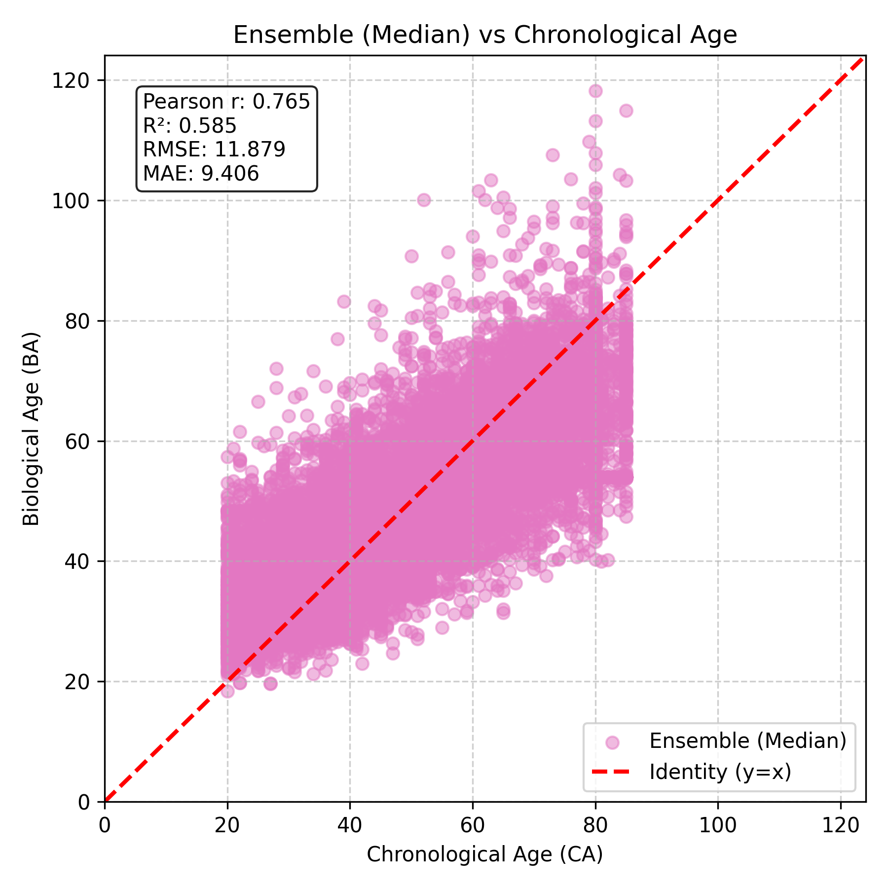

# BA-comp

A biological age comparison model. This repository contains a complete pipeline to estimate, evaluate, and ensemble Biological Age using both classical statistical approaches and machine learning algorithms.

## Overview

This pipeline allows users to calculate biological age from a given set of clinical biomarkers. It splits the data into training and testing sets, ensures consistent evaluation across all methods, and compares the following models:

* Klemera-Doubal Method (KDM)
* PCA-Dubina
* Elastic Net
* Random Forest
* XGBoost
* Ensemble (Mean or Median combinations)

## Repository Structure

* main.py: The core Python script that runs the data processing, model training, and evaluation.
* config.yml: The control center for the pipeline. Users can adjust inputs, imputation methods, train/test split ratios, hyperparameters, and toggle models on or off.
* nhanes4_model_input.csv: The input dataset containing chronological age and biomarker values for this test.
* requirements.txt: List of necessary Python dependencies.
* results/: Directory containing the generated prediction CSV files and evaluation plots.

## Setup and Usage

1. Install the required dependencies:

```bash
pip install -r requirements.txt
```

2. Adjust the parameters in config.yml to suit your dataset and experimental needs.

3. Run the pipeline:

```bash
python3 main.py
```

## Results and Visualizations

The pipeline automatically generates prediction dataframes and plots mapping the estimated Biological Age against Chronological Age for the test set. The generated visual comparisons include:

### KDM Model


### PCA-Dubina Model


### Elastic Net Model


### Random Forest Model


### XGBoost Model


### Ensemble Model

